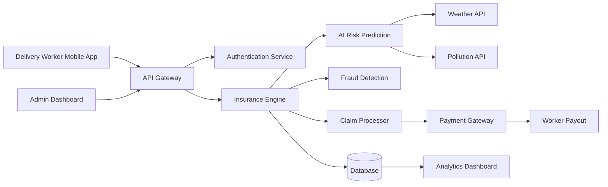

# GigShield AI  
### AI-Powered Parametric Insurance Platform for Gig Delivery Workers


## Project Overview

GigShield AI is an AI-powered parametric insurance platform designed to protect gig economy delivery workers from income loss caused by external disruptions such as extreme weather, pollution, and sudden regional restrictions.

Gig workers such as Swiggy, Zomato, Amazon, or Zepto delivery partners earn income only when they are actively working. However, events like heavy rainfall, extreme heat, floods, or curfews can temporarily stop deliveries, leading to immediate income loss.

GigShield AI addresses this problem by automatically detecting disruptions and triggering instant payouts using a parametric insurance model.

Instead of manually filing claims, the system automatically identifies disruption events using external data sources and compensates workers for lost income.

The platform integrates AI for risk prediction, dynamic premium calculation, and fraud detection to ensure fair pricing and prevent misuse.


## Problem Statement

India’s gig economy heavily relies on delivery partners working for platforms such as Swiggy, Zomato, Amazon, and Zepto.

These workers earn income on a daily basis and are vulnerable to external disruptions like heavy rain, extreme heat, high pollution levels, or government restrictions.

During such disruptions, deliveries may be halted, causing gig workers to lose a significant portion of their income.

Currently, there is no insurance system that protects gig workers from income loss caused by these external factors.

The goal of this project is to build an AI-powered parametric insurance platform that automatically detects disruptions and provides instant compensation for lost income.


## Weekly Premium Model

GigShield AI follows a weekly subscription model aligned with the earning cycle of gig workers.

Example Pricing Model:

| Plan | Weekly Premium | Maximum Payout |
|-----|-----|-----|
Basic | ₹10/week | ₹300 |
Standard | ₹20/week | ₹600 |
Premium | ₹30/week | ₹1000 |

Premium pricing is dynamically adjusted using AI risk models based on location, weather history, and disruption probability.


## Parametric Disruption Triggers

The system automatically triggers payouts when certain conditions are met.

Examples include:

Heavy Rainfall  
Rainfall exceeding 70 mm in a specific region.

Extreme Heat  
Temperature exceeding 42°C.

Air Pollution  
AQI levels exceeding 300.

Curfews or Restricted Zones  
Government restrictions that prevent deliveries.

These triggers are monitored using external APIs and simulated datasets.


## AI / ML Integration

AI is integrated into the platform in multiple areas.

Risk Assessment Model  
Machine learning models analyze historical weather and environmental data to calculate disruption risks.

Dynamic Premium Calculation  
Premium pricing adjusts based on location risk factors and predicted disruption probability.

Fraud Detection System  
AI models identify suspicious claim patterns and detect anomalies in worker activity.


## Fraud Detection

To prevent misuse of the system, GigShield AI includes intelligent fraud detection mechanisms.

Location Validation  
Worker GPS location must match the disruption zone.

Duplicate Claim Detection  
Prevents multiple claims for the same disruption event.

Behavior Analysis  
Machine learning models identify abnormal claim patterns.

Historical Data Comparison  
Claims are validated using past weather and disruption records.

## Technology Stack

Frontend  
React / React Native

Backend  
Node.js with Express

AI/ML  
Python (Scikit-learn / TensorFlow)

Database  
MongoDB / PostgreSQL

Cache  
Redis

Cloud Infrastructure  
AWS (EC2, Lambda, S3)

External APIs  
Weather API  
Air Quality API

Payment Gateway  
Razorpay Sandbox / Stripe Test Mode


## System Architecture




---

# 1️⃣1️⃣ Application Workflow Diagram

```markdown
## Application Workflow

```mermaid
flowchart TD

Start[Worker Registers]

Start --> Policy[Buy Weekly Insurance Plan]

Policy --> Monitor[System Monitors External Data]

Monitor --> WeatherCheck{Disruption Detected?}

WeatherCheck -->|Yes| Trigger[Parametric Trigger Activated]

Trigger --> FraudCheck[Fraud Detection]

FraudCheck -->|Valid| Payout[Instant Payout Processed]

Payout --> Notify[Worker Receives Notification]

WeatherCheck -->|No| Continue[Continue Monitoring]


---

# 1️⃣2️⃣ Data Flow Diagram

```markdown
## Data Flow Diagram

```mermaid
flowchart LR

Worker --> App
App --> Backend
Backend --> WeatherAPI
Backend --> PollutionAPI
Backend --> RiskModel

RiskModel --> ClaimsEngine
ClaimsEngine --> PaymentGateway
PaymentGateway --> Worker


---

# 1️⃣3️⃣ Future Enhancements

```markdown
## Future Enhancements

• Integration with delivery platform APIs  
• Real-time GPS verification  
• Blockchain-based claim transparency  
• Advanced predictive risk modeling  
• Real-time disruption alerts for workers

## Deliverables

• AI-powered parametric insurance platform prototype  
• System architecture and workflow diagrams  
• GitHub repository with documentation  
• Demonstration video explaining the solution
