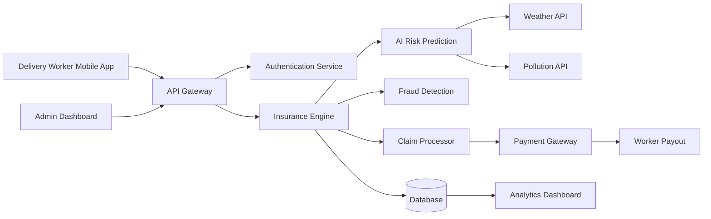
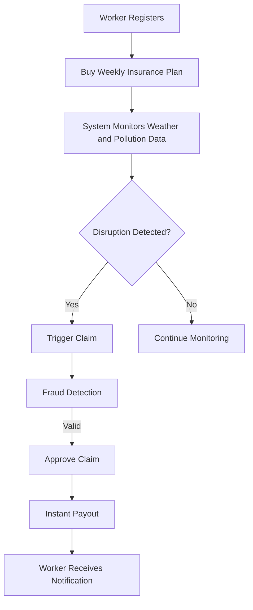
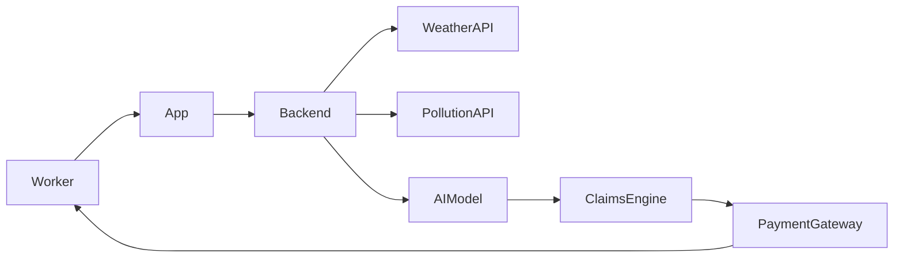

# GigShield AI  
### AI-Powered Parametric Insurance Platform for Gig Delivery Workers


## Project Overview

GigShield AI is a parametric insurance platform designed to protect gig economy delivery workers from income loss due to external disruptions like extreme weather, pollution, and sudden regional restrictions.

Gig workers, such as Swiggy, Zomato, Amazon, or Zepto delivery partners, earn money only when they are actively working.

Events like heavy rainfall, extreme heat, floods, or curfews can halt deliveries, leading to immediate income loss.

GigShield AI solves this issue by automatically detecting disruptions and triggering instant payouts through a parametric insurance model.

Instead of filing claims manually, the system uses external data sources to identify disruptions and compensates workers for lost income.

The platform uses AI for risk prediction, premium calculation, and fraud detection to ensure fair pricing and prevent misuse.


## Problem Statement

India’s gig economy heavily relies on delivery partners working for platforms like Swiggy, Zomato, Amazon, and Zepto.

These workers earn money daily and are vulnerable to external disruptions like heavy rain, extreme heat, high pollution levels, or government restrictions.

During these disruptions, deliveries may stop, and gig workers can lose a significant portion of their income.

Currently, there is no insurance system that protects gig workers from income loss caused by these external factors.

The goal of this project is to create an AI-powered parametric insurance platform that automatically detects disruptions and provides instant compensation for lost income.

## Persona Based Scenario

Persona: Ravi – Food Delivery Partner (Swiggy)

Age: 26  
City: Chennai  
Average Daily Earnings: ₹600  
Weekly Earnings: ₹3500 – ₹4500  

Scenario:

Ravi works as a Swiggy delivery partner in Chennai.  
During heavy rainfall, many restaurants temporarily stop delivery operations.

Because of this disruption, Ravi cannot accept orders for several hours and loses part of his daily income.

GigShield AI detects the extreme rainfall event using weather APIs and automatically triggers a payout for Ravi based on the insured coverage plan.

This ensures Ravi receives compensation for the lost working hours without manually filing a claim.


## Weekly Premium Model

GigShield AI uses a weekly subscription model aligned with the earning cycle of gig workers.

Example Pricing Model:

| Plan | Weekly Premium | Maximum Payout |
|-----|-----|-----|
Basic | ₹10/week | ₹300 |
Standard | ₹20/week | ₹600 |
Premium | ₹30/week | ₹1000 |

Premium pricing is dynamically adjusted using AI risk models based on location, weather history, and disruption probability.


## Parametric Disruption Triggers

The system automatically triggers payouts when certain conditions are met.

Examples include:

Heavy Rainfall  
Rainfall exceeding 70 mm in a specific region.

Extreme Heat  
Temperature exceeding 42°C.

Air Pollution  
AQI levels exceeding 300.

Curfews or Restricted Zones  
Government restrictions that prevent deliveries.

These triggers are monitored using external APIs and simulated datasets.


## AI / ML Integration

AI is integrated into the platform in multiple areas.

Risk Assessment Model  
Machine learning models analyze historical weather and environmental data to calculate disruption risks.

Dynamic Premium Calculation  
Premium pricing adjusts based on location risk factors and predicted disruption probability.

Fraud Detection System  
AI models identify suspicious claim patterns and detect anomalies in worker activity.


## Fraud Detection

To prevent misuse of the system, GigShield AI includes intelligent fraud detection mechanisms.

Location Validation  
Worker GPS location must match the disruption zone.

Duplicate Claim Detection  
Prevents multiple claims for the same disruption event.

Behavior Analysis  
Machine learning models identify abnormal claim patterns.

Historical Data Comparison  
Claims are validated using past weather and disruption records.

## Technology Stack

Frontend  
React / React Native

Backend  
Node.js with Express

AI/ML  
Python (Scikit-learn / TensorFlow)

Database  
MongoDB / PostgreSQL

Cache  
Redis

Cloud Infrastructure  
AWS (EC2, Lambda, S3)

External APIs  
Weather API  
Air Quality API

Payment Gateway  
Razorpay Sandbox / Stripe Test Mode

## Development Plan

Phase 1 – Ideation & Design
• Problem research
• Persona definition
• System architecture
• UI wireframes

Phase 2 – Core System Development
• Worker registration system
• Weekly insurance policy management
• Dynamic premium calculation
• Parametric disruption trigger engine

Phase 3 – AI & Automation
• Fraud detection system
• Risk prediction models
• Automated claims processing

Phase 4 – Dashboard & Deployment
• Worker dashboard
• Admin analytics dashboard
• Payment simulation integration


## System Architecture




---

## Application Workflow



## Data Flow Diagram



# 1️⃣3️⃣ Future Enhancements

```markdown
## Future Enhancements

• Integration with delivery platform APIs  
• Real-time GPS verification  
• Blockchain-based claim transparency  
• Advanced predictive risk modeling  
• Real-time disruption alerts for workers

## Deliverables

• AI-powered parametric insurance platform prototype  
• System architecture and workflow diagrams  
• GitHub repository with documentation  
• Demonstration video explaining the solution
